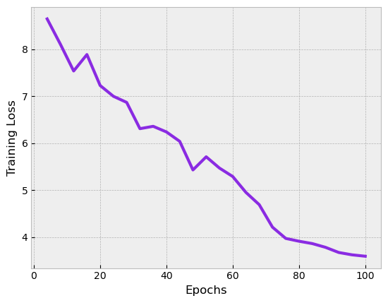

#### Introduction

This folder contains the implementation of a Conditional Variational Auto-Encoder (CVAE) that is trained to generate fashion clothing items given a prompt, similar to the images in the `$ROOT/data` folder. The `$ROOT` directory has the following structure:

```
├── cvae/
│   ├── config.json
│   ├── cvae.py
│   ├── dataloader.py
│   ├── logger.py
│   ├── requirements.txt
│   └── train.pu
└── data/
    ├── compressed_images/
    │   ├── image_id_1.jpg
    │   ├── image_id_2.jpg
    │   └── ...
    └── product_data.json
```

The directory folders and files do the following:

* `cvae/` contains the main code for the CVAE model.
  * `config.json` defines the configuration parameters that can be tweaked for training the model.
  * `cvae.py` defines the model architecture.
  * `dataloader.py` helps load the data in `$ROOT/data/` into a suitable format for the model to work with. It mainly consists of transforming the images, tokenizing the text, and returning an `(image,text)` pair in the standard ____getitem____() method.
  * `logger.py` instantiates a logger to track the training progress.
  * `requirements.py` lists all the necessary modules and packages required to run this model.
  * `train.py` is the main training script. It gets the dataset from `dataloader.py`, splits it into train and validation data, captures the training configuration from `config.py`, and trains a from-scratch CVAE model in the `cvae.py` file.

#### Steps

1. Use `pip install -r requirements.txt` to install the required packages.
2. From the `$ROOT/cvae` directory, run `python train.py` to train the model. Logs will be stored in `logfile.txt` after training.


The training loss curve for the current `config.json` file is below:


