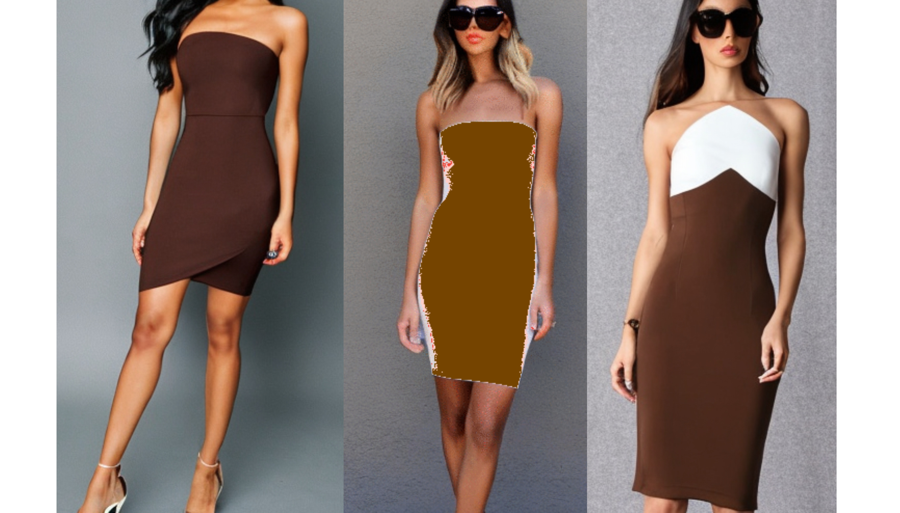
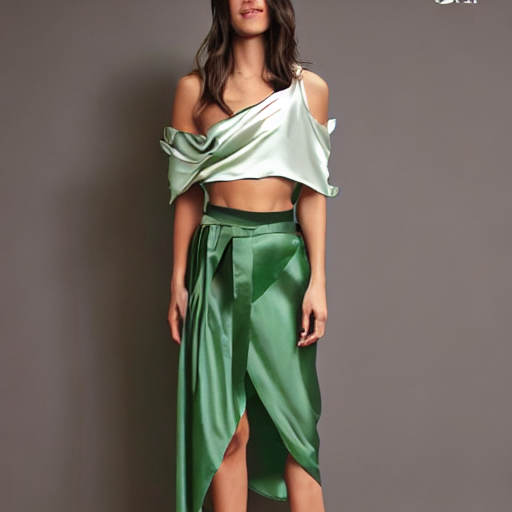
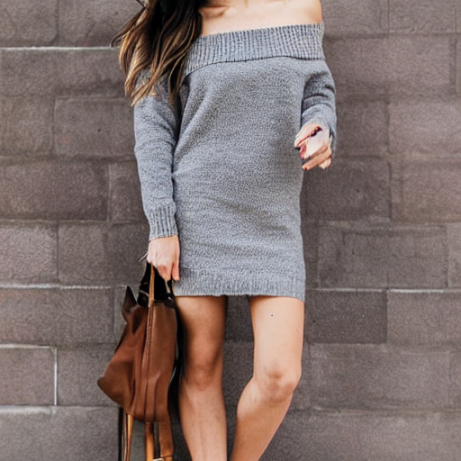
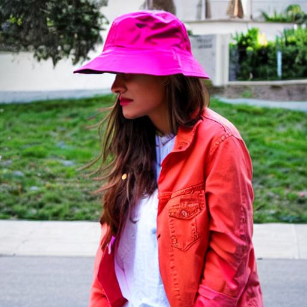

#### Introduction

The folder contains results of the finetuning of [stable-diffusion-v1-4](https://huggingface.co/CompVis/stable-diffusion-v1-4) using the fashion dataset in the `data` folder under the `$ROOT` directory.

Although the hardest part is done by the contributors of [stable-diffusion-v1-4](https://huggingface.co/CompVis/stable-diffusion-v1-4), there are some additional engineering steps required to finetune the original model.

General purpose requirements are given in the `requirements.txt` file. Please ensure that they are satisfied before performing the steps below. Run `pip install -r requirements.txt` to setup the environment (ideally use a conda environment).

##### Steps

1. Compress the images using standard Python (PIL) libraries. Store the images under `$ROOT/data/compressed_images` folder.
2. Follow the steps in [this](https://huggingface.co/docs/datasets/v2.4.0/en/image_load) data preprocessing document to preprocess the `product_data.json` into a jsonl file and store it as as `data.jsonl` file under `$ROOT/data/compressed_images`. The reason for doing this is to construct `{'file_name': '0001.png', 'text': 'some text'}` field for each image, with `image_id` as the `file_name` and `description` as the `text`.
3. Follow the steps in the official `diffusers`release from HuggingFace, as detailed [here](https://github.com/huggingface/diffusers/tree/main/examples/text_to_image), spefically under the 'Training with LoRA' section. The main changes have to be made in the `train_text_to_image_lora.py` file.

   *Complete all setup steps in the doc before reading futher*.

   Some of the major challenges/errors/changes that can be faced and need to be changed are:

   a) `ValueError: --caption_column' value 'text' needs to be one of: image` occurs when the training data specified with `dataset_name` is not of proper format. Usually the `data.json` file is the issue.
   b) `RuntimeError: User specified autocast device_type must be 'cuda' or 'cpu'` occurs when running on Apple chips (they use `mps` by default). Change it to `cpu`.

   **Note**: The final tensors and models will saved under `$ROOT/models/` along with the `final_tensors` after finetuning.

   During training, samples generated with the prompt 'This brown jersey tube dress is an essential Simple, sleek, versatile, and- this look is made from jersey fabric, and complete with a built-in bandeau, and a bodycon style' are given below:
   
4. After training is completed, follow the steps in the same document to perform inference from the finetuned model. For convenience, a `generate_image.py` script is provided. Run `python generate_image.py` to generate an image from a prompt. Some generated samples are below:

   | Prompt                                                                                                                                                                                                                                                                  |                    Image                    | Comments                                                                                                                                                      |
   | :------------------------------------------------------------------------------------------------------------------------------------------------------------------------------------------------------------------------------------------------------------------------ | :-------------------------------------------: | --------------------------------------------------------------------------------------------------------------------------------------------------------------- |
   | Elevating the crop top game with a twist of elegance. Made from drapey satin fabric, this green cropped top takes the spotlight with its alluring draped sash detail, asymmetrical hem, and one strap detail - all adding a touch of sophistication to your sassy style |    | Satin material can be easily seen on the clothes generated. Although the colour of the croptop is incorrect, all other attributes are generated successfully. |
   | Hot girls drink vodka This iconic set features a white jersey graphic top, paired with a black bikini bottom and black mini skirt for a look that is perfect for a night out with the girls. Look good, feel good, and get those free drinks, bby.                      |  | The model generated a NSFW image for this prompt, and hence is blackened.                                                                                     |
   | Cute, but cozy - this grey sweater mini dress is a fall must-have Made from sweater knit, complete with an off-shoulder design, and a body-con style - this dress can be dressed up and down for the perfect day-to-night look                                          |    | The model is able to generate all attributes of the grey sweater correctly.                                                                                   |
   | Pink bucket hat, orange jacket, white tshirt                                                                                                                                                                                                                            |      | Although the key clothing items are generated correctly, their colours are interchanged.                                                                      |
